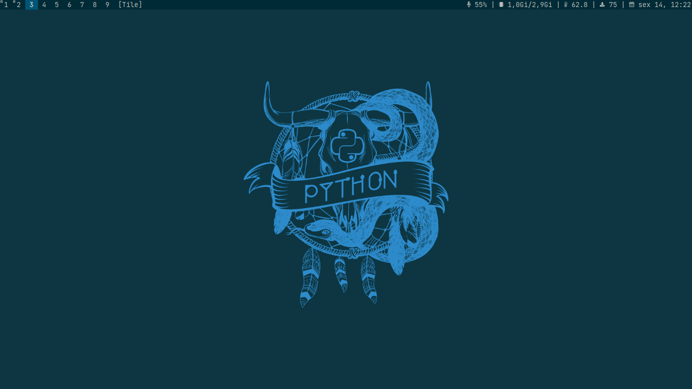

#      DWM



My fork of suckless [dwm](https://dwm.suckless.org/).

##      Patches
- actualfullscreen
- cool-autostart
- cyclelayouts
- fullgaps
- killunsel
- restartsig
- scratchpads
- swallow
- centeredwindowname
- killunsel
- rotatestack
- xresources

##      Installation guide
```
git clone https://github.com/diegorezm/dwm-d.git
cd dwm-d
sudo make install
```
